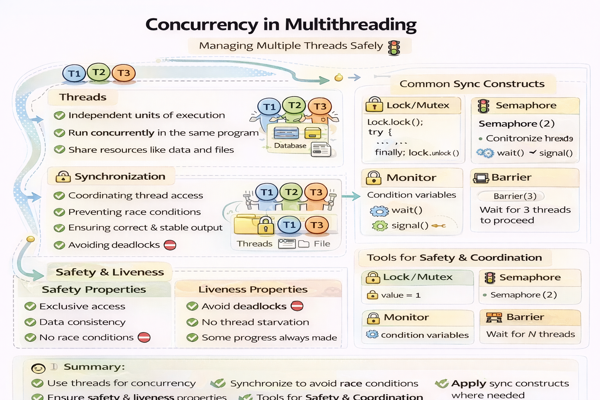

# Concurrent-and-Distributed-Systems

Concurancy is the ability of a system to handle multiple tasks at the same time, while distribution refers to the ability of a system to run on multiple machines or nodes. Concurrent and distributed systems are designed to improve performance, scalability, and fault tolerance by allowing multiple tasks to be executed simultaneously across different machines.

In this repository, the main concepts and techniques related to concurrent and distributed systems are explored through a series of labs and exercises. The repository covers topics such as threads, synchronization, monitors, semaphores, safety and liveness properties, and more. Each lab includes explanations, examples, and code snippets to help understand the concepts and apply them in practice.



```
    Concurrent and Distributed Systems
    ├── lab1-threads
    ├── lab2-synchronisation
    ├── lab3-monitor-and-semaphores
    ├── lab4-deadlock
    ├── lab5-safety-and-properties
    (... other labs and exercises ...)
```

---

All the labs and exercises for the course "Concurrent and Distributed Systems" at the University of Bradford.

Java is the main programming language used in the course, but some exercises may also involve other languages or tools related to concurrent and distributed systems.

To build and run the code in the labs, you can use any Java IDE (like IntelliJ IDEA, Eclipse, or NetBeans) or command-line tools (like `javac` and `java`).

Example of how to compile Java code from the command line:

```java
    javac -d target/classes src/recipe03/*.java
```

The compiled classes will be placed in the `target/classes` directory.

Example of how to run Java code from the command line:

```java
    java -cp target/classes recipe03.Main
``` 

This command runs the `Main` class located in the `recipe03` package, using the compiled classes from the `target/classes` directory.

