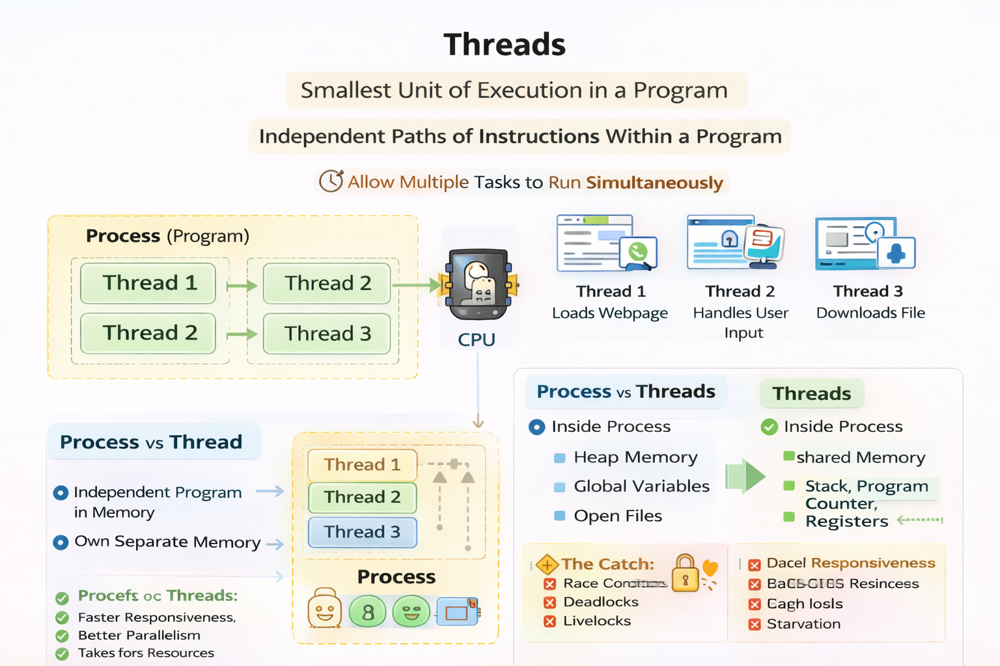

# Threads

In Java, **threads are lightweight execution units** that run inside a process and share the same memory space, enabling concurrent execution and improved performance and responsiveness.



Threads are used to allow a program to execute multiple tasks concurrently within the same process. They improve performance by using multiple CPU cores, keep applications responsive by running long tasks in the background, and are widely used to handle multiple users or requests at the same time (in servers, each client request can be handled by a separate thread). Threads also help organise code by separating different responsibilities such as computation, input/output, and communication.

## Processes vs Threads
- A **process** is an instance of a running program with its own memory space.
- A **thread** is a lightweight unit of execution that exists inside a process.
- Multiple threads within the same process **share memory and resources**, which makes communication efficient but also introduces synchronization challenges.

PS: Thread support is built into Java through the `java.lang.Thread` class and the `java.util.concurrent` package.

## Creating, Running, and Setting the Characteristics of a Thread

In Java, threads can be created in two main ways:

### 1. Extending the `Thread` class
```java
class MyThread extends Thread {
    public void run() {
        System.out.println("Thread running");
    }
}

MyThread t = new MyThread();
t.start();
```

### 2. Implementing the `Runnable` interface (recommended)

```java
class MyRunnable implements Runnable {
    public void run() {
        System.out.println("Runnable running");
    }
}

Thread t = new Thread(new MyRunnable());
t.start();
```
- Extending `Thread` creates a thread by inheritance, while implementing `Runnable` separates the task from the thread, allowing better design and more flexibility.
- `extends` is used in Java to indicate inheritance, allowing a class to inherit attributes and methods from another class.
- An interface in Java defines a contract that specifies methods a class must implement, without providing their implementation.

### Thread Characteristics

Each thread has important attributes:

* **ID**: unique identifier
* **Name**: useful for debugging
* **Priority**: value between 1 (MIN) and 10 (MAX), default is 5
* **State**: NEW, RUNNABLE, BLOCKED, WAITING, TIMED_WAITING, TERMINATED

> Note: Thread priority is only a hint to the OS scheduler and does not guarantee execution order.

## Interrupting a Thread

Java does not forcefully stop threads.
Instead, threads are **interrupted cooperatively** using the `interrupt()` method.

```java
Thread worker = new Thread(() -> {
    while (!Thread.currentThread().isInterrupted()) {
        System.out.println("Working...");
    }
});
worker.start();
worker.interrupt();
```

* `interrupt()` sets the interrupted flag
* The thread must **check the interruption status** and terminate gracefully
* Blocking methods like `sleep()` or `join()` throw `InterruptedException`

## Sleeping and Resuming a Thread

Threads can pause execution using `Thread.sleep()`:

```java
try {
    Thread.sleep(1000); // sleep for 1 second
} catch (InterruptedException e) {
    System.out.println("Thread interrupted while sleeping");
}
```

Key points:

* `sleep()` puts the thread into the **TIMED_WAITING** state
* The thread automatically resumes after the specified time
* If interrupted, an `InterruptedException` is thrown

## Processing Uncontrolled Exceptions in a Thread

If a thread throws an unchecked exception and it is not handled, the thread **terminates immediately**.

Java provides a mechanism to handle these exceptions:

```java
Thread.setDefaultUncaughtExceptionHandler(
    (t, e) -> System.out.println("Exception in thread " + t.getName())
);
```

This allows:

* Centralized error handling
* Better debugging in multithreaded applications
* Preventing silent thread termination

## Using Local Thread Variables

Thread-local variables allow each thread to have **its own independent copy** of a variable.

```java
ThreadLocal<Integer> threadLocalValue = new ThreadLocal<>();

threadLocalValue.set(10);
Integer value = threadLocalValue.get();
```

Benefits:

* Avoids synchronization
* Prevents shared-state bugs
* Commonly used for user sessions, transactions, or context data

Each thread accessing the `ThreadLocal` gets **its own value**, even if they share the same variable reference.