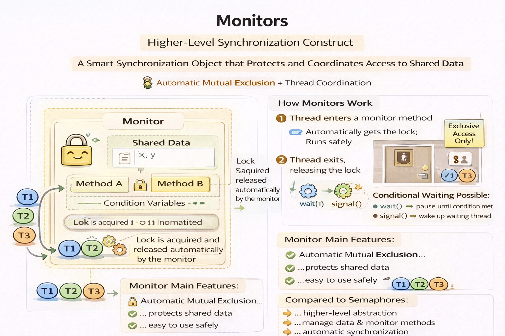
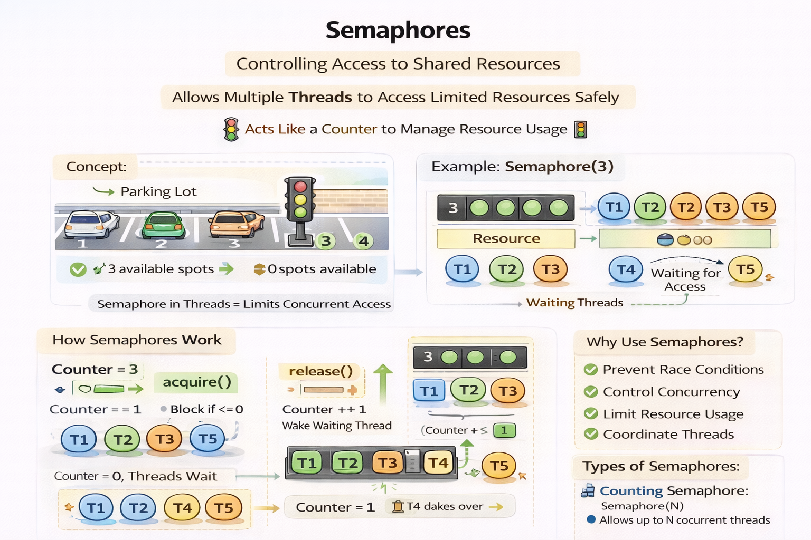

# Monitors and Semaphores
| Thread Synchronization Utilities and mechanisms.

## **Monitors** 
A high-level synchronization construct that provides a convenient and safe way to manage access to shared resources. A monitor is essentially an object that encapsulates shared data and the operations that can be performed on that data, along with the synchronization mechanisms needed to ensure that only one thread can access the shared data at a time. Gauarantees mutual exclusion and condition synchronization.

- Thread - active entity which initiates actions
- Monitor - passive entity which responds to actions.

**Condition synchronization** permits a monitor to suspend a thread until a certain condition is true. This is typically implemented using condition variables, which allow threads to wait for specific conditions to be met before proceeding.
- A counter becoming non-zero
- A buffer becoming empty
- New input becoming available

## **Semaphores** 
A semaphore is a counter that controls access to one or more shared resources. A generic synchronization mechanisms that you can use to protect any critical section in any problem.

- CountDownLatch: The `CountDownLatch` class is a mechanism provided by the Java language that allows a thread to wait for the finalization of multiple operations.

- CyclicBarrier: The `CyclicBarrier` class is another mechanism provided by the Java language that allows the synchronization of multiple threads at a common point.

- Phaser: The `Phaser` class is another mechanism provided by the Java language that controls the execution of concurrent tasks divided in phases. All the threads must finish one phase before they can continue with the next one.

- Exchanger: The `Exchanger` class is a synchronization point at which threads can pair and swap elements within pairs.

- CompletableFuture: The `CompletableFuture` class is a mechanism provided by the Java language that allows the execution of asynchronous tasks and the composition of their results.

## **Semaphores vs Monitors**

| Feature                   | Monitor                        | Semaphore                              |
| ------------------------- | ------------------------------ | -------------------------------------- |
| Level                     | High-level abstraction         | Lower-level mechanism                  |
| Mutual Exclusion          | Automatic                      | Manual (depends on usage)              |
| Structure                 | Protects data + methods        | Counter only                           |
| Safety                    | Safer and less error-prone     | More prone to programming errors       |
| Lock Management           | Automatic acquire/release      | Must manually call acquire()/release() |
| Condition Synchronization | Built-in (condition variables) | Must be implemented manually           |
