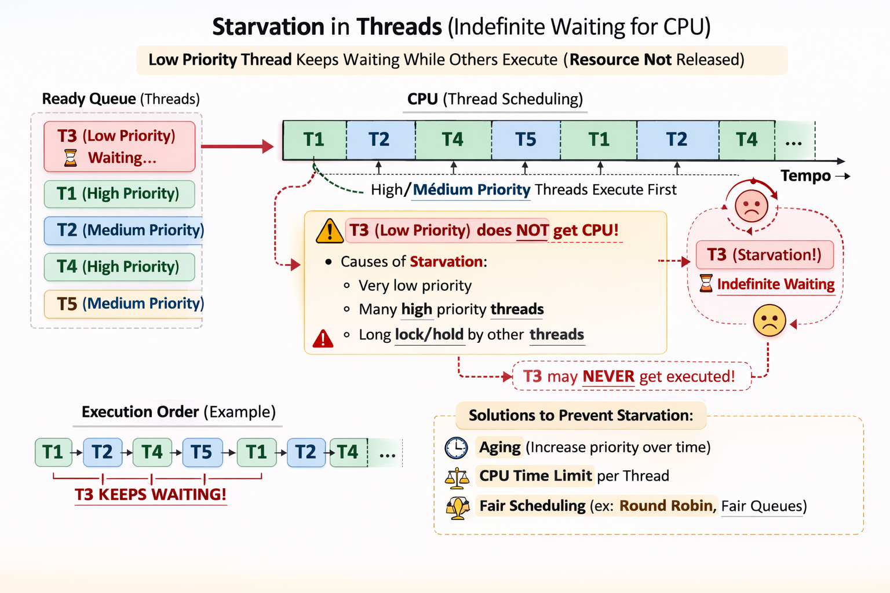
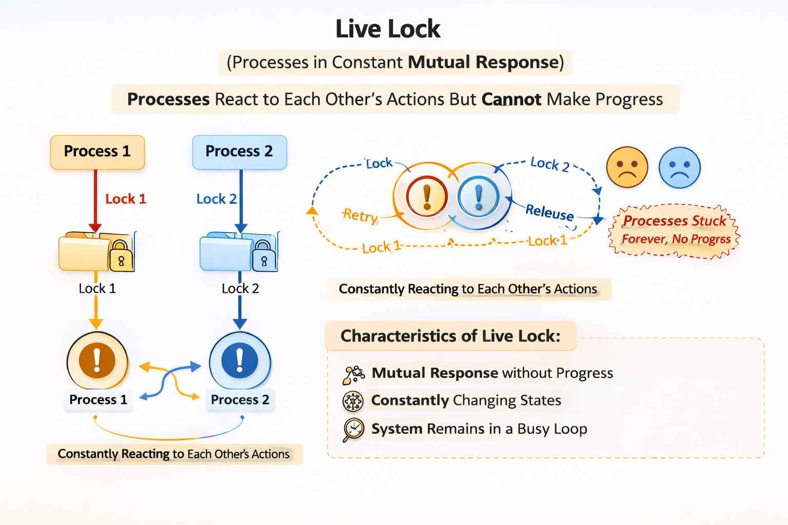
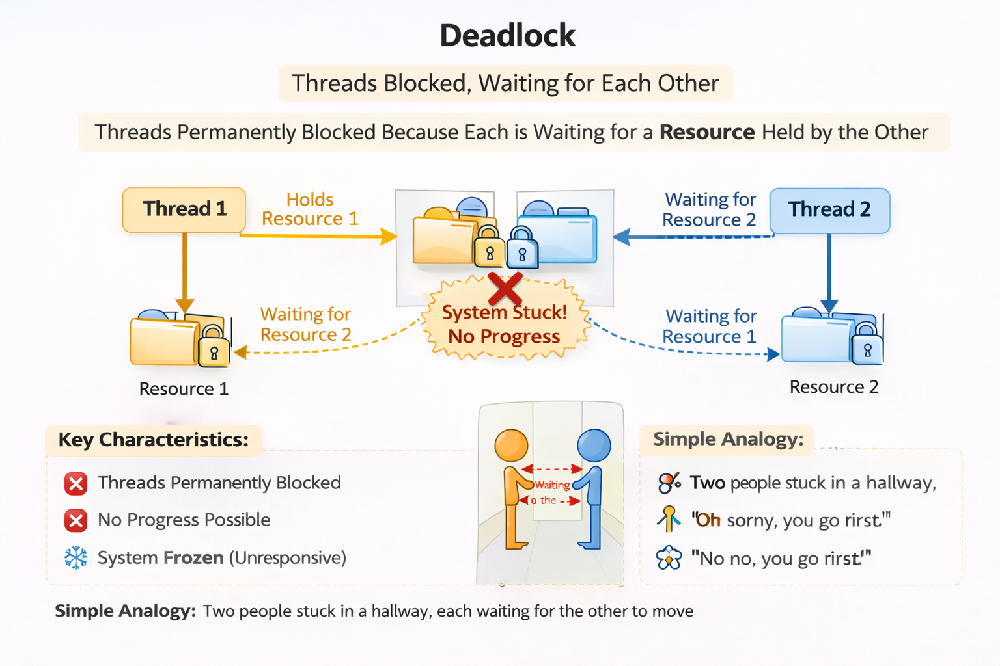
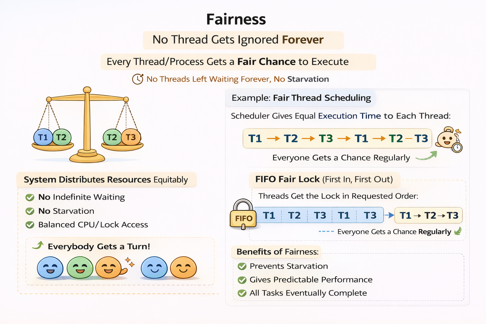

# Safety and Liveness

The **safety** property is about the system never reaching a bad state. Such as mutual exclusion of critical sections and the absence of deadlock.
- Correct input-output behavior;
- Non-violation of operation restrictions on data types (e.g. division by 0, head of an empty list, etc.).

The **liveness** property is about the system eventually reaching a good state. Such as the eventual access to critical sections and the absence of starvation.
- The most important liveness property for a sequential program is that it eventually **terminates**;
- For concurrent programs, the most important liveness property is that it eventually **progresses** (e.g. a process waiting for a critical section will eventually get access to it).

In concurrent programming, we are frequently concerned with systems that do not terminate. For such systems, we are interested in ensuring that they make progress and do not get stuck in a state where they cannot continue (e.g. deadlock or starvation).

## Starvation
Starvation occurs when a process is is unable to gain regular access to shared resources and is unable to make progress.

## Livelock
- A thread often acts in response to the action of another thread.

Livelock occurs when processes continuously change their state in response to each other without making any progress. For example, two processes might continuously yield to each other, preventing either from proceeding.

- The threads are not blocked — they are simply too busy responding to each other to resume work!

## Deadlock
Deadlock occurs when a group of processes are each waiting for another process in the group to release a resource, creating a cycle of dependencies that prevents any of the processes from proceeding. For example, if Process A holds Resource 1 and waits for Resource 2, while Process B holds Resource 2 and waits for Resource 1, neither process can proceed, resulting in a deadlock.

## Fairness
Fairness is a property of scheduling algorithms that ensures that all processes get a chance to execute (no one waits forever). A scheduling algorithm is considered fair if it guarantees that every process will eventually be scheduled to run, preventing starvation and ensuring that all processes have an opportunity to make progress.

### Weak Fairness
Weak fairness, also known as justice, requires that if a process is continuously enabled (i.e., it can execute), then it will eventually be scheduled to run. However, if a process is only intermittently enabled, there is no guarantee that it will ever be scheduled.

e.g: If a person raises their hand and keeps it raised the whole time → they are going to speak.

### Strong Fairness
Strong fairness, also known as compassion, requires that if a process is enabled infinitely often (i.e., it can execute at infinitely many points in time), then it will eventually be scheduled to run. This means that even if a process is only intermittently enabled, as long as it is enabled infinitely often, it will eventually get a chance to execute.

e.g: If a person raises their hand several times throughout the meeting, at some point they will speak.