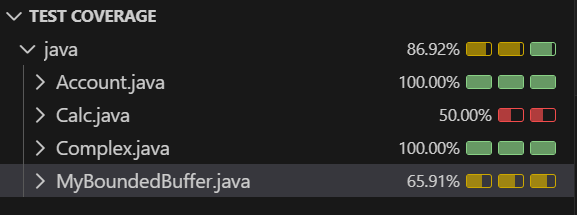

# Testing Concurrent Programs

Testing concurrent programs can be challenging due to the non-deterministic nature of thread scheduling and the potential for race conditions. However, there are several techniques and tools that can help in testing concurrent programs effectively.

1. **Unit Testing**: Write unit tests for individual components of the concurrent program. Use frameworks like JUnit for Java to create test cases that can be run automatically.
2. **Stress Testing**: Create tests that simulate high load and concurrency to identify potential issues under stress. This can help uncover race conditions and deadlocks that may not appear in normal testing scenarios.
3. **Thread Sanitizers**: Use tools like ThreadSanitizer to detect race conditions and other concurrency issues. These tools can analyze the program's execution and identify potential problems.
4. **Mocking and Stubbing**: Use mocking frameworks to simulate the behavior of concurrent components. This can help isolate specific parts of the program and test them independently.

# JUnit and Concurrency
JUnit is a popular testing framework for Java that can be used to write and run tests for concurrent programs. When testing concurrent code with JUnit, it's important to consider the following:
- Use `@Test` annotation to define test methods.
- Use `@Before` and `@After` annotations to set up and tear down test environments.
- Use `CountDownLatch` or `CyclicBarrier` to synchronize threads in tests.
- Use `assert` statements to verify the expected outcomes of concurrent operations.

```java
    assertEquals(expected, actual);
```

This assertion checks if the expected value matches the actual value produced by the concurrent operation. If they do not match, the test will fail, indicating a potential issue in the concurrent code.

## How to Run Tests

Since using the VS Code IDE and the extension "Extension Pack for Java", there are several ways to run the tests:
- 1. By clicking on the test symbole next to the class or method (right click gives more options);
- 2. By selecting "Testing" at the side menu. 

It is possible to run all the tests, or just a subset of them. The results will be displayed in the "Testing" panel, showing which tests passed and which failed, along with any error messages or stack traces for failed tests.

Besides that, it is also possible to debug the tests by clicking on the "Debug" option and see the test coverage by clicking on the "Coverage" option. This can help identify which parts of the code are being tested and which are not, allowing for more comprehensive testing of concurrent programs.


