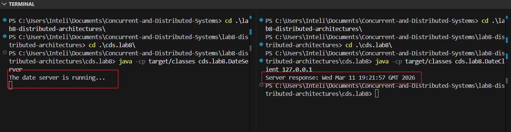
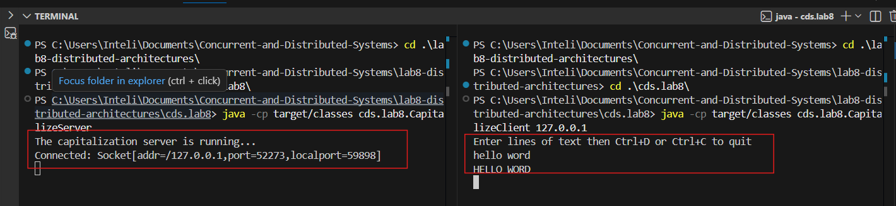
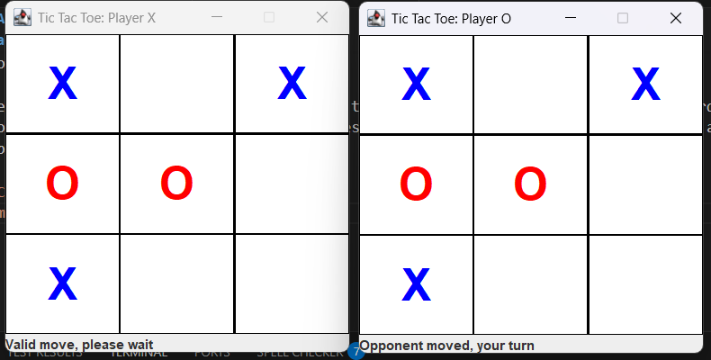
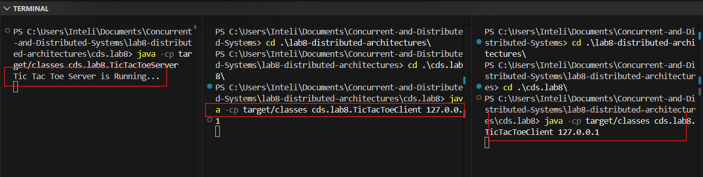
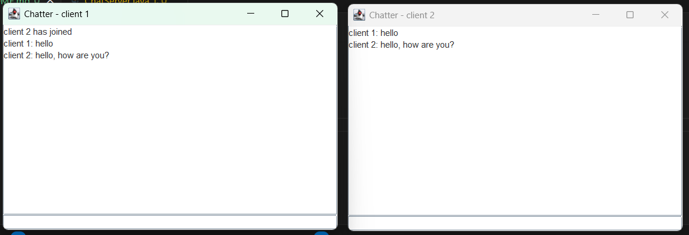
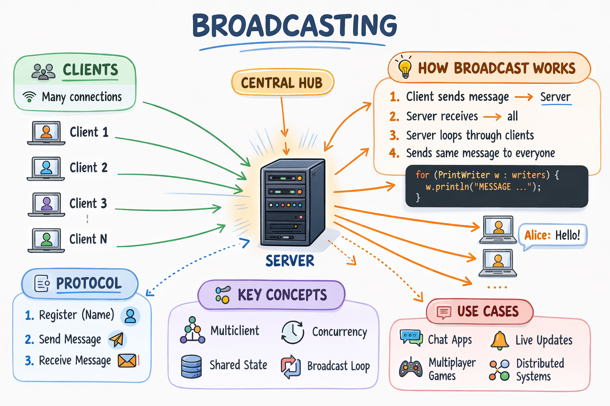
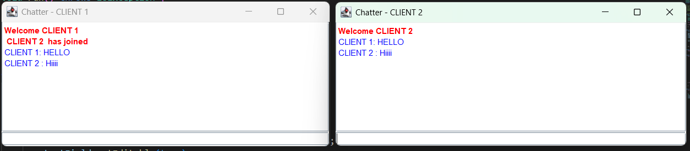
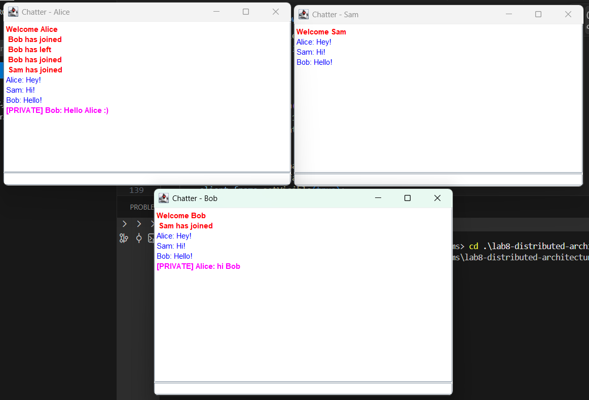

# Distributed Architectures

## Simple One-Way Communication
`DateServer.java` and `DateClient.java` demonstrate a simple one-way communication between a server and a client.

The server sends data to the client only. 

`Client  ----socket---->  Server`

The server opens a socket and waits for the client to connect. Once the client connects, the server sends data to the client. The client receives the data and processes it. The communication is one-way, meaning that the client does not send any data back to the server.

The `ServerSocket` class is used to create a server socket that listens/waits for incoming connections. It specifies the port number on which the server will listen for connections. The `accept()` method is called to wait for a client to connect. Once a client connects, a new socket is created for communication with that client.

The client creates a socket and connects to the server using the server's IP address and port number. Once the connection is established, the client can receive data from the server. On my case, I used `localhost` as the server's IP address since both the server and client are running on the same machine.

`Client → 127.0.0.1 : 59090`



## Two-Way Communication

`CapitalizeServer.java` and `CapitalizeClient.java` demonstrate a simple two-way communication between a server and a client.

`Client → Server`
`Server → Client`

In two-way communication, both the client and server can send data to each other. The server can send data to the client, and the client can also send data back to the server. This allows for more interactive communication between the client and server. The server can send a response to the client after receiving data from the client, and the client can send requests to the server and receive responses. This type of communication is more common in real-world applications where the client and server need to exchange information in both directions.



### Real Flow Example:
Client: "hello world"
        ↓
Server recieves "hello world"
        ↓
Server transforms it to uppercase
        ↓
Server sends "HELLO WORLD"
        ↓
Client shows response

## Kepping track of state
`TicTacToeServer.java` and `TicTacToeClient.java` demonstrate a simple two-way communication between a server and a client, while keeping track of the state of the game.

In this example, the server maintains the state of the tic-tac-toe game, including the game board and the current player's turn. The client sends moves to the server, and the server updates the game state accordingly. The server also checks for win conditions and sends updates back to the client.




### Real Flow Example:
Player X clicks on the board
      ↓
Client sends the move to the server
      ↓
Server validates the move
      ↓
Server updates the board
      ↓
Server sends the update
      ↓
Player O receives the update

### Conclusion - State Management

The server controls the whole game - board state, turns and winner. 

The **trak of the state** is controlled by the `board` and `currentPlayer` variables. The `board` saves who occupied the board's square, if the position is null, the square is empty. If it has a Player's refence, then that square bengs to that player.
- `private Player[] board = new Player[9];`

The **turns** are controlled by the `cuurentPlayer` variable. Once the move is done, the turn goes to the opponent.
- `Player currentPlayer;`

Each client has its ownn **thread** witch allows multiple clients to connect to the server and play the game simultaneously. The server can handle multiple clients by creating a new thread for each client connection. This allows the server to manage the state of the game for each client independently, while still maintaining the overall game state on the server.

- `var pool = Executors.newFixedThreadPool(200);` & `pool.execute(game.new Player(listener.accept(), 'X'));`

The most important method is:
```java
public synchronized void move(int location, Player player) {
        if (player != currentPlayer) {
            throw new IllegalStateException("Not your turn");
        } else if (player.opponent == null) {
            throw new IllegalStateException("You don't have an opponent yet");
        } else if (board[location] != null) {
            throw new IllegalStateException("Cell already occupied");
        }
        board[location] = currentPlayer;
        currentPlayer = currentPlayer.opponent;
    }
```
The `synchorized` method protects the shared resource - the board.

The victory is detected in the `hasWinner()` and `boardFilledUp()` methods where they check the board's different winner combinations and if all the squared were filled up, respectively.

## Broadcasting
`ChatServer.java` and `ChatClient.java` demonstrate a simple chat application where the server broadcasts messages to all connected clients.

```
      Client A sends "hello"
            ↓
      Server receives it
            ↓
      Server loops through all writers
            ↓
      Client A sees it
      Client B sees it
      Client C sees it
```



A broadcast network allows to send the same message from one source to all conected receivers.



#### Activity 2

With the porpouse to distinguish the system's message from the user's message, new starts were created at the server, such as:

```java
      for (PrintWriter writer : writers) {
            writer.println("SYSTEM  " + name + " has left");
      }
```

At the client, a new helper method was created to print colored text with another message componet `JTextPane()`.

and the message handling was updated:

```java
else if (line.startsWith("SYSTEM ")) {
    appendColored(line.substring(7), Color.GRAY, true);
}

else if (line.startsWith("MESSAGE ")) {
    appendColored(line.substring(8), Color.BLACK, false);
}

else if (line.startsWith("PRIVATE ")) {
    appendColored(line.substring(8), Color.MAGENTA, true);
}
```



### Activity 3

To support private messages, the server must be able to send a message to **one specific client instead of broadcasting it to all connected clients**.

#### 1. User-to-Connection Mapping

A `Map<String, PrintWriter>` was introduced on the server to associate each username with its corresponding output stream.

```java
private static Map<String, PrintWriter> userWriters = new HashMap<>();
```

When a user successfully registers, their output stream is stored:

```java
userWriters.put(name, out);
```

This allows the server to quickly find the connection associated with a specific username.

---

#### 2. Private Message Command

A private message can be sent using the command:

```
/pm <username> <message>
```

Example:

```
/pm Bob Hello Bob, this is a private message
```

The server parses the message to extract the target user and message content.

---

#### 3. Routing the Message

Instead of broadcasting the message to all clients, the server retrieves the recipient's writer from the map:

```java
PrintWriter targetWriter = userWriters.get(targetUser);
```

If the user exists, the server sends the message only to that client:

```java
targetWriter.println("PRIVATE " + sender + ": " + message);
```

Optionally, the sender receives a confirmation message.

---



#### 4. Difference Between Broadcast and Private Messages

**Broadcast message (public chat):**

```java
for (PrintWriter writer : writers) {
    writer.println("MESSAGE " + name + ": " + input);
}
```

This sends the message to **all connected clients**.

**Private message:**

```java
PrintWriter targetWriter = userWriters.get(targetUser);
targetWriter.println("PRIVATE " + name + ": " + message);
```

This sends the message to **only one specific client**.

---

### 5. Conceptual Model

The server acts as a **message router**:

```
Client → Server → Specific Client
```

Clients do not communicate directly with each other.
All messages pass through the server, which decides whether to **broadcast** them or deliver them **privately**.
