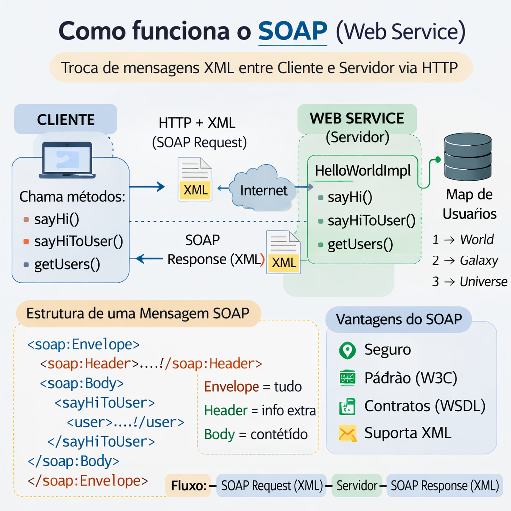
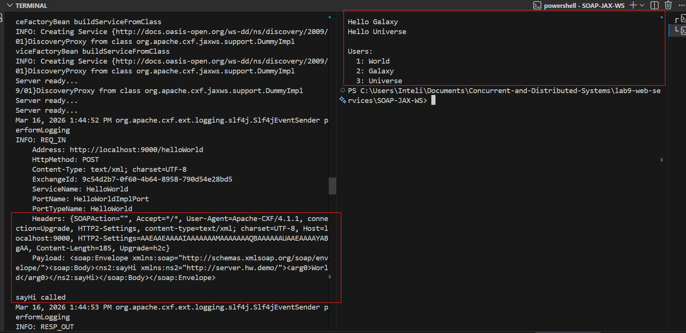
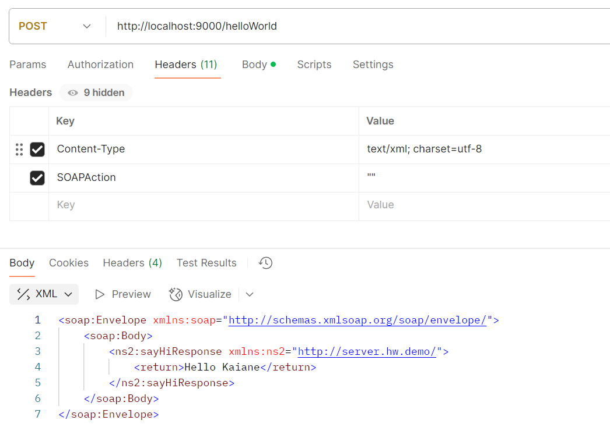

# Web Services

Web services are standardized interfaces that enable different software applications to communicate and exchange data over a network, typically the internet, regardless of their underlying platforms or programming languages. They allow machine-to-machine interaction using protocols like HTTP, REST, or SOAP, often transferring data in XML or JSON formats

### Key Architectures:
- **REST** (Representational State Transfer): Lightweight, stateless, and widely used for web services, leveraging HTTP methods.
- **SOAP** (Simple Object Access Protocol): A more structured, standardized protocol using XML.

e.g architecture:
`Client  --->  Web Service Server  --->  Data`
`Mobile App  --->  API  --->  Database`

## SOAP 



SOAP (Simple Object Access Protocol) is **an XML-based messaging protocol for exchanging structured information between applications**, enabling secure and reliable communication between diverse systems (e.g., C# to Java) over HTTP or SMTP. It is highly standardized by W3C, making it ideal for enterprise-level web services, finance, and sensitive data exchange.

#### Key Aspects of SOAP:
- Structure: SOAP messages are encased in an "Envelope" containing a **mandatory Body and an optional Header** for authentication or routing.
- Protocol Independence: While often used with HTTP, SOAP can operate over various protocols like SMTP.
- Stateful: SOAP often requires applications to maintain state between requests, which can increase memory requirements.
- Security & Reliability: Features built-in compliance with W3C standards, such as WS-Security for encrypted, secure communication.
- SOAP vs. REST: SOAP is more rigid, structured, and secure, while REST is generally faster, lightweight, and more scalable

#### Basic SOAP Structure:

```java
<soap:Envelope xmlns:soap="http://www.w3.org/2003/05/soap-envelope">
  <soap:Header>
    <!-- Optional headers (e.g., security) -->
  </soap:Header>
  <soap:Body>
    <!-- Mandatory Body (e.g., method calls, results) -->
  </soap:Body>
</soap:Envelope>
```

- There is a SOAP service
- It is defined by an interface ``(HelloWorld)``
- It is implemented by a class ``(HelloWorldImpl)``
- It is published by the server
- It is consumed by the client
- It exchanges data over the network
- To serialize some complex types (``User`` interface and ``Map<Integer, User>``), the project uses adapters


**HelloWorld.java**
-> defines the service methods

**HelloWorldImpl.java**
-> implements the methods
-> stores the users in the map

**Server.java**
-> publishes the service to localhost:9000/helloWorld

**Client.java**
-> connects to the service
-> calls the remote methods
-> prints the users

**User / UserImpl**
-> user object

**UserAdapter / IntegerUserMapAdapter / IntegerUserMap**
-> conversion to XML/SOAP

```
Java Objects
     ↓
JAXB (converte para XML)
     ↓
SOAP Envelope
     ↓
HTTP
```

#### Running the SOAP project:

**From the `SOAP-JAX-WS` folder:**

1. The jars available at `/lib` are neeeded, that's why to compile it is better to use:

`javac -cp "../lib/*" -d out src/main/java/demo/hw/server/*.java src/main/java/demo/hw/client/*.java`

2. Run the server with:

`java -cp "out;../lib/*" demo.hw.client.Client`

3. Run the client in another termial:

`java -cp "out;../lib/*" demo.hw.client.Client`



#### Testing SOAP Communication Using Postman

**The body**
```json
<soap:Envelope xmlns:soap="http://schemas.xmlsoap.org/soap/envelope/">
  <soap:Body>
    <ns2:sayHi xmlns:ns2="http://server.hw.demo/">
      <arg0>Kaiane</arg0>
    </ns2:sayHi>
  </soap:Body>
</soap:Envelope>
```




## Objective

The objective of this test was to manually verify the communication between the SOAP client and the SOAP web service by sending HTTP requests directly to the service endpoint using Postman. This allows observation of the SOAP request and response messages exchanged between the client and the server.

###  Service Endpoint

The SOAP web service was running locally and exposed the following endpoint:

```
http://localhost:9000/helloWorld
```

The WSDL describing the service contract was available at:

```
http://localhost:9000/helloWorld?wsdl
```

The WSDL document defines the operations provided by the service, including:

* `sayHi`
* `sayHiToUser`
* `getUsers`


## SOAP Request Example

To test the `sayHi` operation, the following SOAP envelope was sent in the request body:

```xml
<soap:Envelope xmlns:soap="http://schemas.xmlsoap.org/soap/envelope/">
  <soap:Body>
    <ns2:sayHi xmlns:ns2="http://server.hw.demo/">
      <arg0>Kaiane</arg0>
    </ns2:sayHi>
  </soap:Body>
</soap:Envelope>
```

This request invokes the `sayHi` method on the web service and sends the string parameter `"Kaiane"`.

---

## SOAP Response

The server returned the following SOAP response:

```xml
<soap:Envelope xmlns:soap="http://schemas.xmlsoap.org/soap/envelope/">
  <soap:Body>
    <ns2:sayHiResponse xmlns:ns2="http://server.hw.demo/">
      <return>Hello Kaiane</return>
    </ns2:sayHiResponse>
  </soap:Body>
</soap:Envelope>
```

This confirms that the web service successfully processed the request and returned the expected response.

Testing the SOAP service using Postman allowed direct interaction with the web service without relying on the Java client. By sending SOAP XML envelopes via HTTP POST requests, it was possible to verify that the service endpoint was correctly deployed and that the server processed requests and returned responses in the expected SOAP format.

This confirms that the SOAP web service is functioning correctly and that client-server communication through SOAP messages is working as intended.
